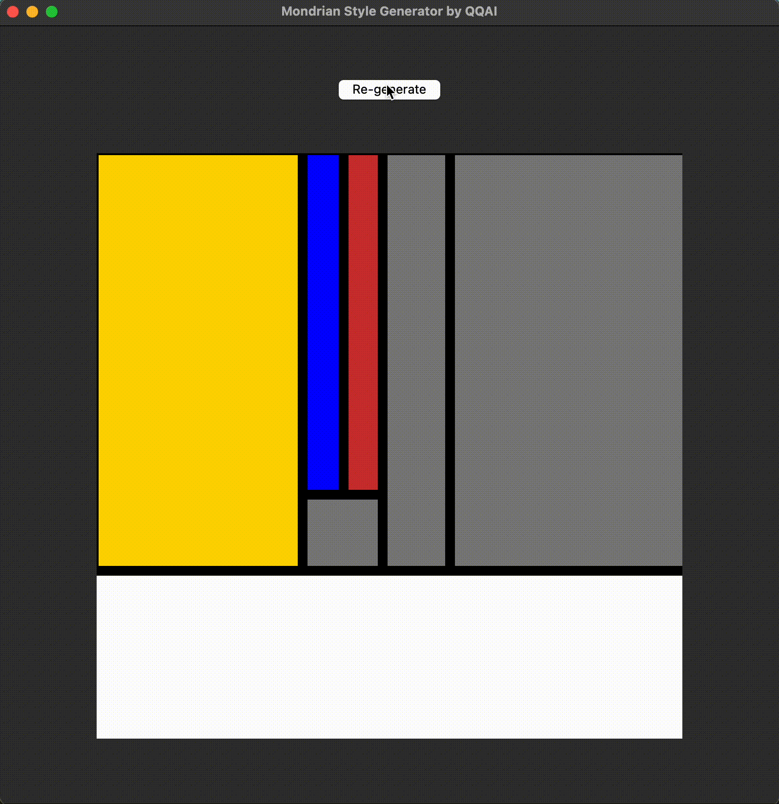

# Mondrian Style Picture Generator

Created this during my break after studying design history! :P

## Usage:

Simply download the entire repository and run main.py:

```
python3 main.py
```



## Who is Mondrian?
- Chekout here: [WikiArt](https://www.wikiart.org/en/piet-mondrian)

- One of his most famous artworks: 

    